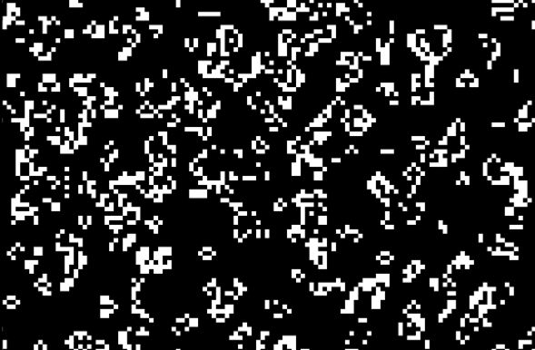
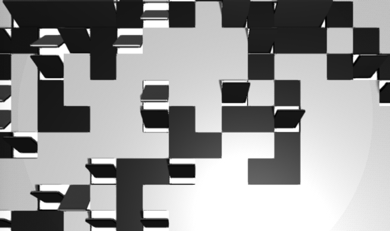
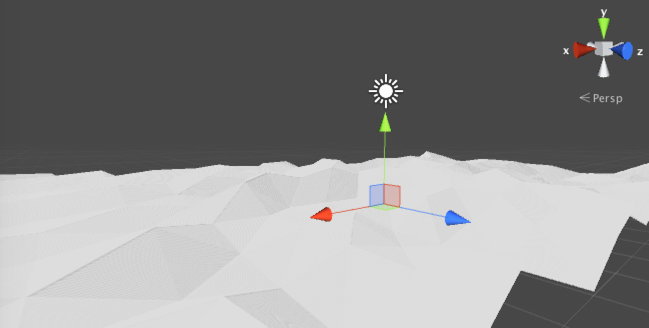
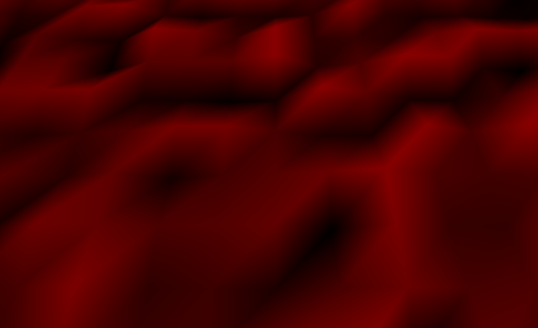

# Game Of Life with Unity!
Game of life implemented with Unity, and with some visualization examples. 
Please extends this projects and make your Game of Life as you want!

## Get Started
* Open this project and import dependent assets.

## Environments
* Unity5.3

## Dependencies
you should import these assets.
* [iTween](https://www.assetstore.unity3d.com/jp/#!/content/84)

## Examples
### Pixel

### Object

### Mesh

### Mesh + Vertex Color

## License
[MIT License](https://opensource.org/licenses/mit-license.php)

## Author

[@gmmsh](https://twitter.com/gmmsh)
